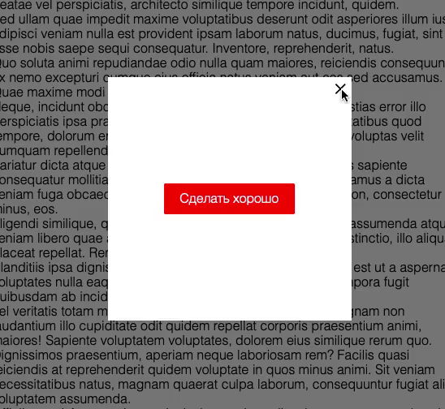

# Всплывающие окна

«Способы поиска нужного HTML-элемента».

## Описание 

Необходимо реализовать возможность открытия и закрытия всплывающих окон по условию.



### Исходные данные

1. Основная HTML-разметка
2. Базовые CSS-стили

Разметка окон представлена следующим кодом:

```html
<div class="modal" id="modal_main">
  <div class="modal__content">
    <div class="modal__close modal__close_times">&times;</div>
    <a href="#" class="btn btn_danger modal__close show-success">Сделать хорошо</a>
  </div>
</div>
```

Для того, чтобы окно было активно (показывалось на странице), добавьте ему класс
*modal_active*:

```html
<div class="modal modal_active">
    <!-- ... -->
</div>
```

Элементы с классом *modal__close* предназначены для закрытия активного окна.

### Процесс реализации

1. В момент запуска скрипта, покажите окно *#modal_main*
2. Сделайте закрытие активного окна по нажатию на его элемент с классом *modal__close*
3. По нажатию на элемент с классом *show-success* покажите окно *#modal_success*
