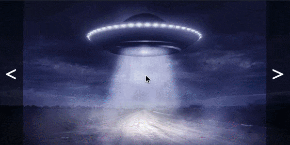

# Слайдер

Домашнее задание к занятию 1.2 «Способы поиска нужного HTML-элемента».

## Описание 

Необходимо реализовать слайдер изображений с бесконечной сменой слайдов.



### Исходные данные

1. Основная HTML-разметка
2. Базовые CSS-стили

Все слайды представлены следующей структурой:

```html
<div class="slider__item">
  
</div>
```

Для того, чтобы конкретный слайд был активен, у него должен быть класс
*slider__item_active*:

```html
<div class="slider__item slider__item_active">
    <!-- ... -->
</div>
```

Навигация с помощью боковых кнопок представлена разметкой:

```html
<div class="slider__arrows">
  <div class="slider__arrow slider__arrow_prev">&lt;</div>
  <div class="slider__arrow slider__arrow_next">&gt;</div>
</div>
```

### Процесс реализации

1. Установите обработчики события *click* на элементах «Влево» и «Вправо»
2. При смене слайдов учитывайте, что навигация должна быть бесконечной. То есть, 
смена крайнего левого слайда должна перекидывать к крайнему правому и наоборот.

_В решении старайтесь делать разделение кода. 
Регистрация обработчиков отдельно, управление слайдером отдельно._